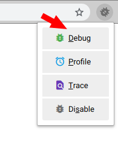
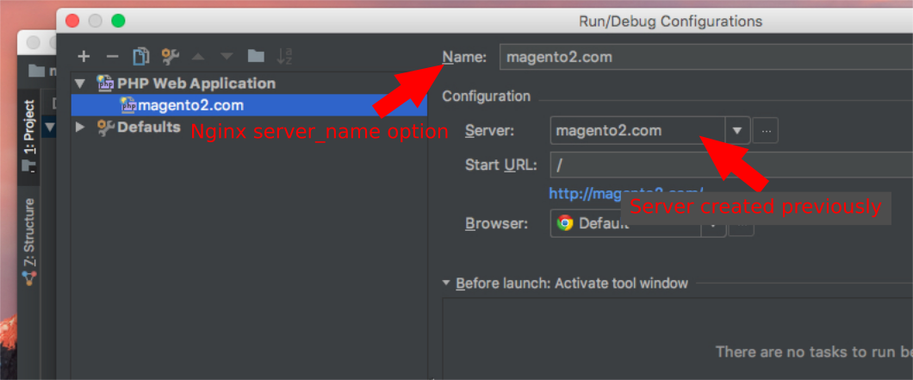

## Requeriments and dependencies
- Docker
- docker-compose
- docker-sync (only macOS)

## How to install **docker-sync** on macOS
```
sudo gem install docker-sync -n /usr/local/bin
```

----------

## How to install **rsync** 
- on macOS
```
brew install rsync
```
- on Debian
```
apt install rsync
```

----------

## How to configure Xdebug

**Configuring xdebug by Browser**

1) The first step is to install the [Browser Toolbar](https://confluence.jetbrains.com/display/PhpStorm/Browser+Debugging+Extensions) and enable listening for PHP Debug Conections



2) After that, the server name must be configured in Nginx.

To achieve this, please modify the nginx config file (file ended in .conf) setting the `server_name` attribute.

The file can be located running the command `warp info` in your root project folder with the "Nginx configuration file" flag


3) Now is time to configure the Web Server in PHPStorm IDE

Please, go to: `File -> Settings->Languages & Frameworks -> PHP -> Servers`

Add a new Server clicking on the plus (+) button and set the following fields:

- `Name:` Must be the same name configured in Nginx `server_name` field
- `Host:` Must be the same value configured in Nginx `server_name` field
- `Port:` Should be 80 if you are using HTTP or 443 if you ar using HTTPS
- `Debbuger:` Choose Xdebug

After configure those values, check the option Use path mappings and configure the right paths. See the table below

|  File/Directory (Your computer - host)  |  absolute path on the Servers (inside the container)  |
|  ----------  |  ------------  |
| /path/to/current/project/     | /var/www/html/     |
| /path/to/current/project/pub/ | /var/www/html/pub/ |


4) Once that the Web Server has been configured, the PHP Web Aplication must be created, so go to Menu: `Run -> Edit Configurations`

Create a new PHP Web Application clicking on the plus (+) button and select the PHP Web Application option, then set the following fields:

- `Name:` Must be the same name configured in Nginx `server_name` field
- `Server:` Select the server created on previous step



**Configuring xdebug by Console (cli)**

Using Xdebug by console requires to set **PHP_IDE_CONFIG** environment var with same Nginx server_name value.

Open the `.env` file located in your root project folder and set the value like this sample:

```bash
PHP_IDE_CONFIG=serverName=magento2.com
```

*Where magento2.com is the server_name set previously in Nginx configuration*


Configuring the Xdebug php extension (ext-xdebug.ini)

Plase located in your root project folder, execute the command: `warp php info`, you will see the location of `ext-xdebug.ini` file.

Open the file, for example located in `.warp/docker/config/php/ext-xdebug.ini`

Finally, make sure to configure your xdebug correctly, the most important options are:

- xdebug.remote_enable=1
- xdebug.remote_port=9000
- xdebug.remote_connect_back=0
- xdebug.idekey='PHPSTORM'
- xdebug.remote_host=172.17.0.1

The field `xdebug.remote_host` depends of your Operating System and your local configurations:
**Linux:** The IP should be grabbed from Docker network interface, ussually called `docker0`
You can get it running the command `ifconfig` for instance:

```bash
docker0: flags=4099  mtu 1500
    inet 172.17.0.1  netmask 255.255.0.0  broadcast 172.17.255.255
    inet6 fe80::42:49ff:fec6:dfe7  prefixlen 64  scopeid 0x20
    ether 02:42:49:c6:df:e7  txqueuelen 0  (Ethernet)
    RX packets 72049  bytes 4443463 (4.4 MB)
    RX errors 0  dropped 0  overruns 0  frame 0
    TX packets 82000  bytes 435500419 (435.5 MB)
    TX errors 0  dropped 0 overruns 0  carrier 0  collisions 0
```

**Mac OS X:** The IP should be `xdebug.remote_host=10.254.254.254` added as an alias following the next steps:

1- Create the alias
```bash
sudo ifconfig lo0 alias 10.254.254.254
```

2- Add the network configuration to OS X launch daemons, to create the alias automatically on system boot process.

```bash
sudo curl -o /Library/LaunchDaemons/net.summasolutions.docker_10254_alias.plist http://ct.summasolutions.net/warp-engine/osx/net.summasolutions.docker_10254_alias.plist
```

----------

## How to use Composer
```
warp composer install
```
----------

## Setting up the Cron Jobs
**Editing The Crontab File**

- To check whether you have a crontab file run the following command:
```
warp crontab -l
```
- To create or edit a crontab file run the following command:
```
warp crontab -e
```

- The file that opens has a lot of information but the key part is the example just before the end of the comments section (comments are denoted by lines beginning with #).

```
# m h dom mon dow command
```
Example:

```
* * * * * www-data echo "Cron run test" >> /var/www/html/cron.log
```

!!! warning
    a blank line is required at the end of this file!

----------

## Installing and configuring Grunt

[features/grunt.html](https://summasolutions.github.io/warp-engine/features/grunt.html)

